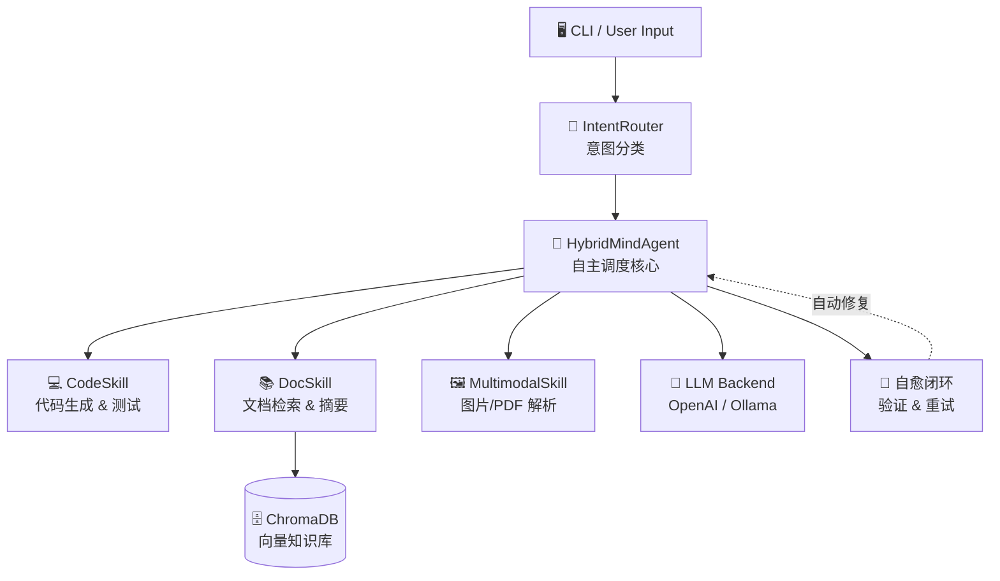

# HybridMind 🧠

> **会思考的多模态知识库 & 自主 Agent 工作台**  
> *Built with ❤️ using Python · ChromaDB · sentence-transformers*

[](https://python.org)
[](LICENSE)
[]()

---

## 🌟 核心亮点

### 1. 🧭 意图驱动路由
收到任务后，HybridMind 先进行"思维分解"，智能判断用户意图属于：
- 💻 **代码开发** — 生成、测试、修复代码
- 📚 **文档检索** — 从本地 RAG 知识库中语义搜索
- 🖼️ **多模态解析** — 解析图片、PDF、Markdown 文件

杜绝将所有内容一股脑塞进上下文！

### 2. 🔁 自我复盘 & 自愈闭环
生成任何输出后，自动启动"自我验证"模式，推演潜在边界异常或 bug。若发现错误，**立刻自动修复并重试**，实现真正的自主工作。

### 3. 🔌 动态技能热加载
现有工具不够用？HybridMind 可以实时编写 Python 代码、动态安装依赖，封装为临时功能模块——无需重启，即刻生效。

### 4. 🔍 全盘文件自动检索
说"读取 xxx.pdf"而文件不在当前目录？HybridMind 自动扫描三层路径：
CWD → 桌面/文档/下载 → 全盘递归搜索（模糊匹配、限时保护），
搜不到还会提示已查过哪些范围，不让你猜。

---

## 🏗️ 架构总览



---

## 📦 安装

### 前置要求
- Python >= 3.9
- pip

### 本地安装

```bash
# 克隆仓库
git clone https://github.com/Molise-Chen/HybridMind.git
cd HybridMind

# 创建虚拟环境
python -m venv venv
# Linux / macOS
source venv/bin/activate
# Windows
venv\Scripts\activate

# 安装依赖
pip install -r requirements.txt
```

### 可选依赖
- **Tesseract OCR**（用于图片文字识别）  
  Windows: [下载安装](https://github.com/UB-Mannheim/tesseract/wiki)  
  macOS: `brew install tesseract`  
  Linux: `apt install tesseract-ocr`

---

## 🚀 快速开始

### 交互模式
```bash
python -m src.main
```

进入 REPL 交互循环：
```
🧠 HybridMind v0.1.0 | 输入 'exit' 退出
>>> 帮我写一个斐波那契数列的 Python 函数
[IntentRouter] → 意图: code
[CodeSkill] → 生成代码中...
✅ 已生成: fibonacci.py
```

### 单次执行
```bash
python -m src.main --input "搜索 Python 闭包的知识"
```

### 添加文档到知识库
```bash
python -m src.main --add ./docs/my_article.pdf
```

---

## 📂 项目结构

```
HybridMind/
├── src/
│   ├── main.py              # CLI 入口
│   ├── config.py            # 全局配置
│   ├── router.py            # 意图路由
│   ├── agent.py             # Agent 调度核心 + 自愈闭环
│   ├── knowledge_base.py    # RAG 知识库 (ChromaDB)
│   ├── skills/
│   │   ├── code_skill.py    # 代码开发技能
│   │   ├── doc_skill.py     # 文档检索技能
│   │   └── multimodal_skill.py  # 多模态解析技能
│   └── utils/
│       ├── logger.py        # 日志工具
│       └── file_utils.py    # 文件读写 + GlobalFileFinder 全盘搜索
├── tests/                   # 单元测试
├── data/                    # 知识库数据 & ChromaDB 持久化
├── requirements.txt
├── README.md
└── LICENSE
```

---

## 🔧 API 概览

| 模块 | 类/函数 | 说明 |
|------|---------|------|
| `router` | `IntentRouter.classify_intent()` | 分类用户意图 |
| `agent` | `HybridMindAgent.process()` | 主处理入口 |
| `knowledge_base` | `HybridKnowledgeBase.query()` | 语义检索 |
| `knowledge_base` | `HybridKnowledgeBase.add_document()` | 添加文档到 KB |
| `skills.code_skill` | `CodeSkill.generate_code()` | 生成代码 |
| `skills.doc_skill` | `DocSkill.answer_from_docs()` | 从文档中回答 |
| `skills.multimodal_skill` | `MultimodalSkill.parse_image()` | 解析图片 |

---

## 🤝 贡献

欢迎提交 Issue 和 Pull Request！  
请确保代码通过 `python -m pytest tests/` 测试。

---

## 📄 许可证

本项目基于 [MIT License](LICENSE) 开源发布。

---

<p align="center">
  <sub>Made with 🧠 and ☕ by HybridMind Team</sub>
</p>
